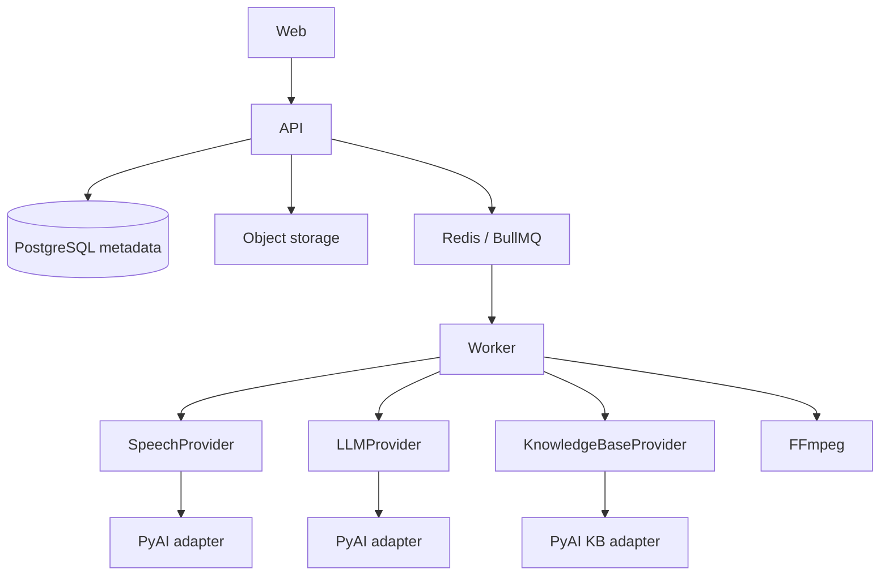

# MintReels

Open-source video intelligence and clipping application.

## Features

- Video recordings
- Speech-to-text
- Transcripts
- Summaries
- VTT subtitles
- AI hooks
- Video clips
- Recording Knowledge Bases
- Global Knowledge Base

## Architecture

- React
- TypeScript
- PostgreSQL
- Redis
- FFmpeg
- PyAI
- PyAI Knowledge Base



This repository is a scaffold: package boundaries, provider interfaces, and placeholders. Recording, transcription, and clipping features are not implemented yet.

## Quick start

```bash
pnpm install
cp .env.example .env
docker compose up -d
pnpm dev
```

See [docs/development.md](docs/development.md), [docs/architecture.md](docs/architecture.md), and [docs/providers.md](docs/providers.md).
