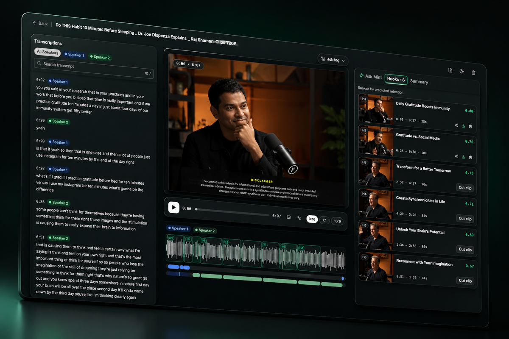
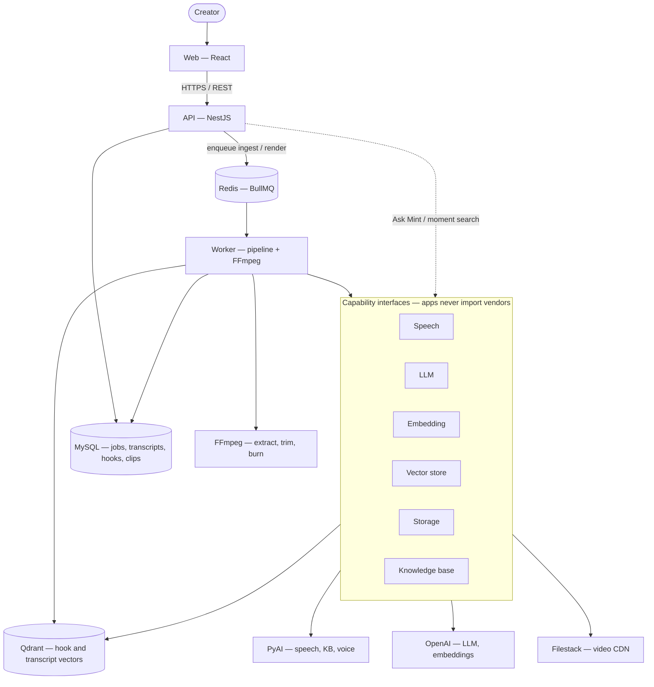

# MintReels

**Transcript-first video intelligence.** Upload a recording, get a timestamped transcript, ranked hooks, and export-ready clips — with visible job states, bounded retries, and providers you can swap.

[License: MIT](LICENSE)
[Node.js](https://nodejs.org)
[pnpm](https://pnpm.io)
[TypeScript](https://www.typescriptlang.org/)



## What it does

Most clipping tools bury the transcript. MintReels treats **timestamped segments as the spine**: search speakers, jump the playhead, rank hooks by predicted retention, then cut vertical clips without a full timeline editor.

Upload an episode → transcribe it → rank the strongest moments → export captioned clips. Ask Mint answers from the transcript or finds a moment you can preview and cut. Every job has a visible state and a real failure reason.

## Features

- **Ingest** — Upload to object storage, speech-to-text, diarized timestamped transcript, VTT
- **Understand** — Summary, speaker filter, Ask Mint, recording knowledge base
- **Clip** — Hooks ranked for retention, 9:16 / 1:1 / 16:9, caption-burned FFmpeg exports
- **Operate** — Async workers, visible `job_steps`, bounded retries, guest sandbox

## Quick start

**Prerequisite:** [Docker Desktop](https://www.docker.com/products/docker-desktop/) (or Engine + Compose).

```bash
git clone https://github.com/praveen-saaslabs/mintreels.git
cd mintreels
cp .env.example .env
docker compose up --build
```

Open **[http://127.0.0.1:5173](http://127.0.0.1:5173)**. First boot installs workspace deps inside containers — usually under a minute. Stop with `docker compose down`.

| Service | URL                                                          |
| ------- | ------------------------------------------------------------ |
| Web     | [http://127.0.0.1:5173](http://127.0.0.1:5173)               |
| API     | [http://127.0.0.1:3000](http://127.0.0.1:3000)               |
| Health  | [http://127.0.0.1:3000/health](http://127.0.0.1:3000/health) |

Dev extras: phpMyAdmin at [http://127.0.0.1:8080](http://127.0.0.1:8080). Local MySQL user/password defaults are `mintreels` / `mintreels` — local only, never for production.

The stack boots without vendor keys. New uploads, re-transcribe, and render need `PYAI_*` and `FILESTACK_*` in `.env`.

### Demo seed (local only)

[fixtures/seed.sql](fixtures/seed.sql) is MySQL metadata: two ready recordings with transcripts, hooks, clips, and job logs. After Compose is up and the API is healthy:

```bash
pnpm install   # once, on the host
pnpm db:seed
```

Log in as `demo@mintreels.io` / `Appletea@401` (**local seed only** — not a production credential). Re-running is a no-op if that email already exists. Seeded Filestack URLs must still be public. Qdrant is not seeded (Ask Mint / moment search need a re-index).

Force-reload and table reset: [docs/development.md](docs/development.md).

## Architecture

The API stays thin. Long work runs in a worker. Vendor SDKs sit behind capability interfaces at composition roots — apps never import them.



Pipeline (capped retries, visible `job_steps`):

1. Upload to Filestack → recording row → enqueue `ingest-video`
2. FFmpeg extracts audio; PyAI speech returns timestamped, diarized segments
3. Summary, transcript embeddings, and ranked hooks fan out from that spine
4. `render-clip` exports MP4 (aspect ratio, burned captions)

| Concern                | Where it lives                                          |
| ---------------------- | ------------------------------------------------------- |
| Product / domain logic | `packages/domain`, API services                         |
| Zod contracts          | `@mintreels/schema`                                     |
| Vendor adapters        | `packages/ai`, `packages/storage`, `packages/knowledge` |
| Wiring                 | `apps/api` + `apps/worker` composition roots only       |
| Binaries               | Filestack (not MySQL)                                   |
| Vectors                | Qdrant (rebuildable; MySQL stays canonical)             |

Deep dive: [docs/architecture.md](docs/architecture.md) · providers: [docs/providers.md](docs/providers.md).

## Stack

Monorepo: **pnpm + Turborepo**. Node.js 20+.

| Layer      | Choice                                      |
| ---------- | ------------------------------------------- |
| Web        | React, React Router, TypeScript             |
| API        | NestJS                                      |
| Data       | MySQL 8 (TypeORM) — metadata only           |
| Queue      | Redis + BullMQ                              |
| Vectors    | Qdrant                                      |
| Media      | FFmpeg (worker)                             |
| Validation | Zod (`@mintreels/schema`)                   |
| AI / KB    | PyAI by default, behind provider interfaces |

| Path                 | Package                | Role                    |
| -------------------- | ---------------------- | ----------------------- |
| `apps/web`           | `@mintreels/web`       | React UI                |
| `apps/api`           | `@mintreels/api`       | HTTP API                |
| `apps/worker`        | `@mintreels/worker`    | Background jobs         |
| `packages/domain`    | `@mintreels/domain`    | Domain types and rules  |
| `packages/schema`    | `@mintreels/schema`    | Zod schemas / DTOs      |
| `packages/db`        | `@mintreels/db`        | MySQL 8 metadata        |
| `packages/ai`        | `@mintreels/ai`        | Speech, LLM, embeddings |
| `packages/knowledge` | `@mintreels/knowledge` | Knowledge Base provider |
| `packages/media`     | `@mintreels/media`     | FFmpeg ops              |
| `packages/storage`   | `@mintreels/storage`   | Object storage          |
| `packages/queue`     | `@mintreels/queue`     | Job queue               |

## Configuration

Copy `.env.example` → `.env`. Never commit `.env` or put secrets in source.

Inside Docker, Compose pins MySQL/Redis to service hostnames (`mysql:3306`, `redis:6379`). On the host, keep `DATABASE_URL` / `REDIS_URL` on `127.0.0.1`.

Add vendor keys when you run real pipelines:

| Variable                                     | Purpose                    |
| -------------------------------------------- | -------------------------- |
| `PYAI_API_KEY` / `PYAI_BASE_URL`             | Speech, knowledge base, VO |
| `FILESTACK_API_KEY` / `FILESTACK_APP_SECRET` | Store / delete media       |
| `VITE_FILESTACK_API_KEY`                     | Browser uploads            |
| `OPENAI_API_KEY`                             | Default LLM and embeddings |

Provider switches (defaults):

```env
AI_PROVIDER=pyai
LLM_PROVIDER=openai
KNOWLEDGE_BASE_PROVIDER=pyai
STORAGE_PROVIDER=filestack
QUEUE_PROVIDER=bullmq
```

Job budgets (`JOB_MAX_ATTEMPTS`, retry delay, stale timeouts) live in `.env.example`. Full local notes: [docs/development.md](docs/development.md).

## Run packages on the host

MySQL, Redis, and Qdrant still via Compose; API, worker, and web on your machine:

```bash
cp .env.example .env
docker compose up -d mysql redis qdrant phpmyadmin
pnpm install
pnpm --filter @mintreels/api start
pnpm --filter @mintreels/worker start
pnpm --filter @mintreels/web dev
```

The worker needs **FFmpeg** on the host for audio extraction and clip render.

## Docs

| Doc                                            | Contents                                  |
| ---------------------------------------------- | ----------------------------------------- |
| [docs/architecture.md](docs/architecture.md)   | Product spine, providers, jobs, decisions |
| [docs/development.md](docs/development.md)     | Install, env, seed, worker notes          |
| [docs/providers.md](docs/providers.md)         | Capability interfaces and adapters        |
| [docs/auth-frontend.md](docs/auth-frontend.md) | Auth / guest session for the web app      |
| [docs/api-frontend.md](docs/api-frontend.md)   | Frontend-facing GET APIs                  |

## Principles

- **Transcript-first** — segments drive search, hooks, and cuts
- **Provider interfaces** — swap AI, storage, or queue without rewriting domain code
- **Async by default** — long work runs in the worker with visible steps
- **Clear exits** — jobs fail with codes and reasons, not silent hangs
- **Bounded retries** — never retry forever
- **Simple infra** — MySQL + Redis + object storage; no Kubernetes required

## Contributing

Issues and PRs welcome. See [CONTRIBUTING.md](CONTRIBUTING.md) for setup, lint, and architecture constraints. This project follows the [Contributor Covenant](CODE_OF_CONDUCT.md). Report vulnerabilities privately — [SECURITY.md](SECURITY.md).

## License

[MIT](LICENSE) © 2026 JustVibe | Runs on [PyAI](https://pyai.com/).
