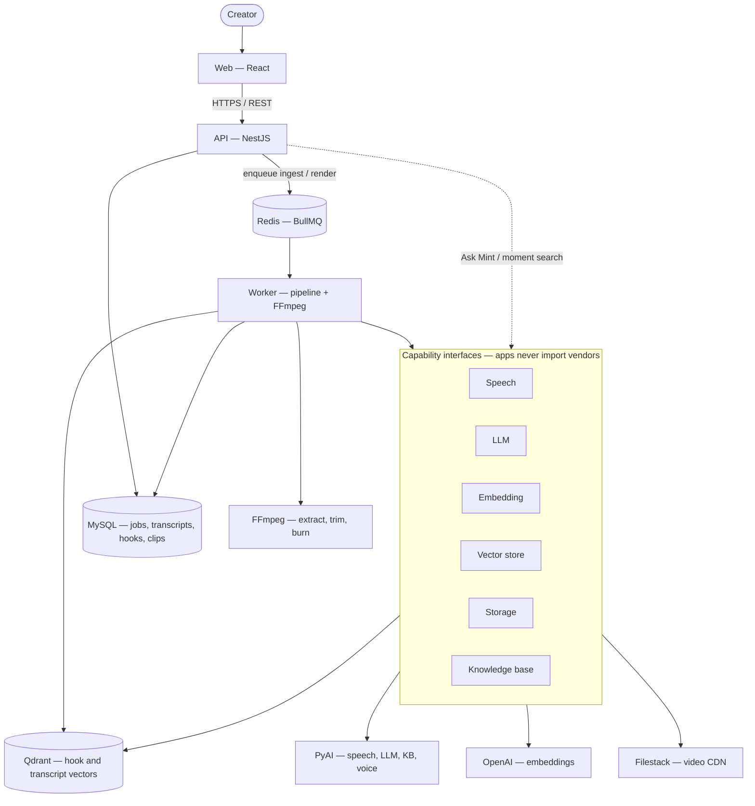
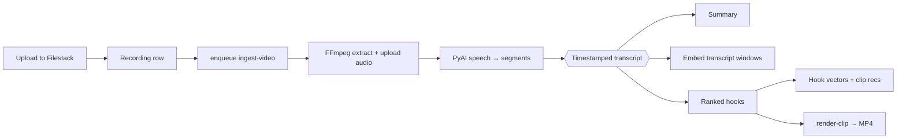

# MintReels

**Transcript-first video intelligence.** Upload a recording, get a timestamped transcript, ranked hooks, and export-ready clips — with clear job states, capped retries, and providers you can swap.

[](LICENSE)
[](https://nodejs.org)
[](https://pnpm.io)


## Why MintReels

Most clipping tools bury the transcript. MintReels treats **timestamped segments as the spine**: search speakers, jump the playhead, rank hooks by predicted retention, then cut vertical clips without a full timeline editor.

| Capability     | What you get                                                                     |
| -------------- | -------------------------------------------------------------------------------- |
| **Ingest**     | Upload → speech-to-text → diarized, timestamped transcript                       |
| **Understand** | Summary, Ask Mint, recording knowledge base                                      |
| **Clip**       | AI hooks ranked for retention, aspect ratios (9:16 / 1:1 / 16:9), FFmpeg exports |
| **Operate**    | Async workers, visible job steps, bounded retries, guest sandbox                 |

## Quick start

**Prerequisite:** [Docker Desktop](https://www.docker.com/products/docker-desktop/) (or Engine + Compose).

```bash
git clone https://github.com/praveen-saaslabs/mintreels.git
cd mintreels
cp .env.example .env
docker compose up --build
```

Open **http://127.0.0.1:5173**. First boot installs workspace deps inside containers — usually under a minute.

| Service    | URL                          |
| ---------- | ---------------------------- |
| Web        | http://127.0.0.1:5173        |
| API        | http://127.0.0.1:3000        |
| Health     | http://127.0.0.1:3000/health |
| phpMyAdmin | http://127.0.0.1:8080        |

Dev DB defaults: user `mintreels` / password `mintreels`.

Stop with `docker compose down`.

### Load the demo project

Sample data ships in [`fixtures/demo-seed.json`](fixtures/demo-seed.json) (Joe Dispenza recording with transcript, hooks, and clips). After the API is up:

```bash
pnpm install   # once, on the host
# Set SEED_DEMO_PASSWORD in .env (local only; hashed at seed time)
pnpm db:seed
```

Log in as `demo@mintreels.local` (or `SEED_DEMO_EMAIL` if you set one) with that password. Re-running the seed is idempotent: it will not duplicate the recording.

> **AI / storage jobs** (new uploads, re-transcribe, render) need `PYAI_*` and `FILESTACK_*` in `.env`. The stack boots without them; browse and demo seed work first.

## Architecture

MintReels is **transcript-first**: the API stays thin, long work runs in a worker, and vendor SDKs sit behind capability interfaces at composition roots.



**Ingest pipeline** (capped retries, visible `job_steps`, critical vs analysis gates):



| Concern | Where it lives |
| --- | --- |
| Product / domain logic | `packages/domain`, API services |
| Zod contracts | `@mintreels/schema` |
| Vendor adapters | `packages/ai`, `packages/storage`, `packages/knowledge` |
| Wiring | `apps/api` + `apps/worker` composition roots only |
| Binaries | Filestack (not MySQL) |
| Vectors | Qdrant (rebuildable; MySQL stays canonical) |

Deep dive: [`docs/architecture.md`](docs/architecture.md) · providers: [`docs/providers.md`](docs/providers.md).

## Stack

| Layer | Choice |
| --- | --- |
| Web | React, React Router, TypeScript |
| API | NestJS |
| Data | MySQL 8 (TypeORM) — metadata only |
| Queue | Redis + BullMQ |
| Vectors | Qdrant |
| Media | FFmpeg (worker) |
| Validation | Zod (`@mintreels/schema`) |
| AI / KB | PyAI by default, behind provider interfaces |

Monorepo: **pnpm + Turborepo**.

## Configuration

Copy `.env.example` → `.env`. Never commit `.env` or put secrets in source.

Inside Docker, Compose pins MySQL/Redis to service hostnames (`mysql:3306`, `redis:6379`). On the host, keep `DATABASE_URL` / `REDIS_URL` on `127.0.0.1`.

**Boot without vendor keys** (Compose defaults cover MySQL/Redis). Add when you run real pipelines:

| Variable                                     | Purpose                                   |
| -------------------------------------------- | ----------------------------------------- |
| `PYAI_API_KEY` / `PYAI_BASE_URL`             | Speech, LLM, knowledge base               |
| `FILESTACK_API_KEY` / `FILESTACK_APP_SECRET` | Store / delete media                      |
| `VITE_FILESTACK_API_KEY`                     | Browser uploads                           |
| `OPENAI_API_KEY`                             | Default embeddings / LLM path for moments |

Provider switches (defaults):

```env
AI_PROVIDER=pyai
KNOWLEDGE_BASE_PROVIDER=qdrant db
STORAGE_PROVIDER=filestack
QUEUE_PROVIDER=bullmq
```

Job budgets (capped retries, stale timeouts): `JOB_MAX_ATTEMPTS`, `JOB_RETRY_BASE_DELAY_MS`, `JOB_STEP_STALE_TIMEOUT_MS` — see `.env.example`.

Full local/dev notes: [`docs/development.md`](docs/development.md).

## Run packages on the host

MySQL + Redis still via Compose; API, worker, and web on your machine:

```bash
cp .env.example .env
docker compose up -d mysql redis qdrant phpmyadmin
pnpm install
pnpm --filter @mintreels/api start
pnpm --filter @mintreels/worker start
pnpm --filter @mintreels/web dev
```

Worker needs **FFmpeg** on the host for audio extraction and clip render.

## Docs

| Doc                                              | Contents                                  |
| ------------------------------------------------ | ----------------------------------------- |
| [`docs/architecture.md`](docs/architecture.md)   | Product spine, providers, jobs, decisions |
| [`docs/development.md`](docs/development.md)     | Install, env, seed, worker notes          |
| [`docs/providers.md`](docs/providers.md)         | Capability interfaces and adapters        |
| [`docs/auth-frontend.md`](docs/auth-frontend.md) | Auth / guest session for the web app      |
| [`docs/api-frontend.md`](docs/api-frontend.md)   | Frontend-facing GET APIs                  |

## Principles

- **Transcript-first** — segments drive search, hooks, and cuts
- **Provider interfaces** — swap AI, storage, or queue without rewriting domain code
- **Async by default** — long work runs in the worker with visible steps
- **Clear exits** — jobs fail with codes and reasons, not silent hangs
- **Bounded retries** — never retry forever
- **Simple infra** — MySQL + Redis + object storage; no Kubernetes required

## Contributing

Issues and PRs welcome. Prefer small, focused changes that match [`docs/architecture.md`](docs/architecture.md). Ask before changing storage, queue, AI, or KB strategy.

```bash
pnpm install
pnpm lint
pnpm typecheck
```

## License

[MIT](LICENSE) © 2026 MintReels
